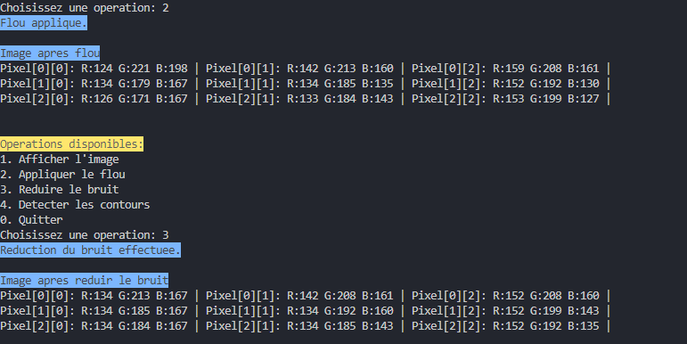
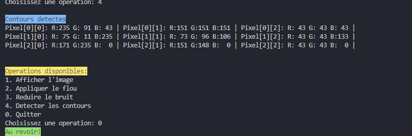

# Projet de Traitement d'Images RGB en C

## Table des Matières
1. [Description](#description)
2. [Installation](#installation)
3. [Structure du Projet](#structure-du-projet)
4. [Fonctionnalités](#fonctionnalités)
5. [Algorithmes Implémentés](#algorithmes-implémentés)
6. [Guide d'Utilisation](#guide-dutilisation)
7. [Aspects Techniques](#aspects-techniques)
8. [Limitations et Améliorations Possibles](#limitations-et-améliorations-possibles)

## Description
Ce projet est un programme de traitement d'images RGB développé en C. Il permet de créer, manipuler et appliquer différents filtres sur des images numériques en utilisant une représentation RGB (Rouge, Vert, Bleu).

## Installation

### Prérequis
- Compilateur GCC
- Make (optionnel)
- Environnement Unix/Linux ou Windows avec compilateur C

### Compilation
```bash
gcc -o traitement_image main.c -lm
```

### Exécution
```bash
./traitement_image
```

## Structure du Projet

### Structure Principale (RGBImage)
```c
typedef struct {
    unsigned char ***data;  // Tableau 3D pour RGB
    int width;             // Largeur
    int height;            // Hauteur
    int resolution;        // Résolution de couleur
} RGBImage;
```

### Organisation des Fichiers
- `main.c` : Programme principal
- `README.md` : Documentation
- `Makefile` : Script de compilation (optionnel)

## Fonctionnalités

### 1. Création d'Image
- Création d'une nouvelle image RGB
- Spécification des dimensions
- Allocation dynamique de mémoire

### 2. Initialisation
- Mode automatique (valeurs aléatoires)
- Mode manuel (saisie utilisateur)
- Gestion de la résolution couleur

### 3. Filtres et Traitements
- Flou (Blur)
- Détection de contours (Sobel)
- Réduction de bruit (Filtre médian)

### 4. Affichage
- Visualisation des valeurs RGB
- Affichage avant/après traitement

## Algorithmes Implémentés

### 1. Filtre de Flou (Blur)
```
Pour chaque pixel P(x,y):
    somme = 0
    count = 0
    Pour chaque voisin V dans fenêtre 3x3:
        Si V est dans l'image:
            somme += V
            count++
    P(x,y) = somme / count
```

### 2. Détection de Contours (Sobel)
#### Matrices de Sobel
```
Gx = [[-1 0 1]    Gy = [[-1 -2 -1]
      [-2 0 2]          [ 0  0  0]
      [-1 0 1]]        [ 1  2  1]]

Magnitude = √(Gx² + Gy²)
```

### 3. Réduction de Bruit (Filtre Médian)
```
Pour chaque pixel:
    Collecter les valeurs des 9 voisins
    Trier les valeurs
    Remplacer par la valeur médiane
```

## Guide d'Utilisation

### Menu Principal
1. Création de l'image
   ```
   Entrez la largeur: _
   Entrez la hauteur: _
   ```

2. Choix d'initialisation
   ```
   1. Valeurs aleatoires
   2. Saisie manuelle
   ```

3. Menu des opérations
   ```
   1. Afficher l'image
   2. Appliquer le flou
   3. Reduire le bruit
   4. Detecter les contours
   0. Quitter
   ```

## Aspects Techniques

### Gestion de la Mémoire
- Allocation dynamique pour les données d'image
- Libération appropriée des ressources
- Gestion des tableaux temporaires

### Performance
- Complexité temporelle : O(w × h) pour les filtres basiques
- Complexité spatiale : O(w × h) pour le stockage

### Sécurité
- Vérification des limites de l'image
- Validation des entrées utilisateur
- Gestion des erreurs d'allocation

## Limitations et Améliorations Possibles

### Limitations Actuelles
1. Pas de support pour les fichiers image
2. Taille limitée par la mémoire disponible
3. Interface en ligne de commande uniquement
4. Pas de prévisualisation graphique

### Améliorations Futures
1. Support des formats d'image standard (PNG, JPEG)
2. Interface graphique
3. Optimisation des performances
4. Filtres supplémentaires
   - Rotation
   - Redimensionnement
   - Ajustement des couleurs

### Notes de Développement
- Version actuelle : 1.0
- Dernière mise à jour : 2024
- Langage : C standard
- Dépendances : stdio.h, stdlib.h, math.h

## Captures d'écran




## Contact et Support
Pour toute question ou suggestion d'amélioration, veuillez créer une issue dans le dépôt du projet.
