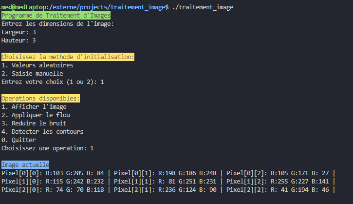
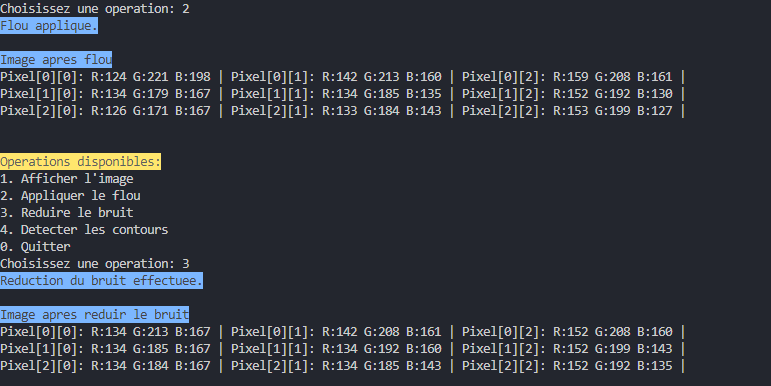

# RGB Image Processing Project in C

## Table of Contents
1. [Description](#description)
2. [Installation](#installation)
3. [Project Structure](#project-structure)
4. [Features](#features)
5. [Implemented Algorithms](#implemented-algorithms)
6. [Usage Guide](#usage-guide)
7. [Technical Aspects](#technical-aspects)
8. [Limitations and Possible Improvements](#limitations-and-possible-improvements)

## Description
This project is an RGB image processing program developed in C. It allows creating, manipulating, and applying various filters to digital images using an RGB (Red, Green, Blue) representation.

## Installation

### Prerequisites
- GCC compiler
- Make (optional)
- Unix/Linux environment or Windows with a C compiler

### Compilation
```bash
gcc -o image_processing main.c -lm
```

### Execution
```bash
./image_processing
```

## Project Structure

### Main Structure (RGBImage)
```c
typedef struct {
    unsigned char ***data;  // 3D array for RGB
    int width;             // Width
    int height;            // Height
    int resolution;        // Color resolution
} RGBImage;
```

### File Organization
- `main.c`: Main program
- `README.md`: Documentation
- `Makefile`: Compilation script (optional)

## Features

### 1. Image Creation
- Create a new RGB image
- Specify dimensions
- Dynamically allocate memory

### 2. Initialization
- Automatic mode (random values)
- Manual mode (user input)
- Color resolution management

### 3. Filters and Processing
- Blur filter
- Edge detection (Sobel)
- Noise reduction (Median filter)

### 4. Display
- View RGB values
- Display before/after processing

## Implemented Algorithms

### 1. Blur Filter
```
For each pixel P(x,y):
    sum = 0
    count = 0
    For each neighbor V in a 3x3 window:
        If V is within the image:
            sum += V
            count++
    P(x,y) = sum / count
```

### 2. Edge Detection (Sobel)
#### Sobel Matrices
```
Gx = [[-1 0 1]    Gy = [[-1 -2 -1]
      [-2 0 2]          [ 0  0  0]
      [-1 0 1]]        [ 1  2  1]]

Magnitude = √(Gx² + Gy²)
```

### 3. Noise Reduction (Median Filter)
```
For each pixel:
    Collect values of the 9 neighbors
    Sort the values
    Replace with the median value
```

## Usage Guide

### Main Menu
1. Image creation
   ```
   Enter width: _
   Enter height: _
   ```

2. Initialization choice
   ```
   1. Random values
   2. Manual input
   ```

3. Operations menu
   ```
   1. Display the image
   2. Apply blur
   3. Reduce noise
   4. Detect edges
   0. Exit
   ```

## Technical Aspects

### Memory Management
- Dynamic allocation for image data
- Proper resource cleanup
- Management of temporary arrays

### Performance
- Time complexity: O(w × h) for basic filters
- Space complexity: O(w × h) for storage

### Security
- Boundary checks for the image
- Validation of user inputs
- Error handling for memory allocation

## Limitations and Possible Improvements

### Current Limitations
1. No support for image files
2. Size limited by available memory
3. Command-line interface only
4. No graphical preview

### Future Improvements
1. Support for standard image formats (PNG, JPEG)
2. Graphical user interface
3. Performance optimization
4. Additional filters:
   - Rotation
   - Resizing
   - Color adjustment

### Development Notes
- Current version: 1.0
- Last update: 2024
- Language: Standard C
- Dependencies: stdio.h, stdlib.h, math.h

## Screenshots



## Contact and Support
For any questions or suggestions, please create an issue in the project repository.
